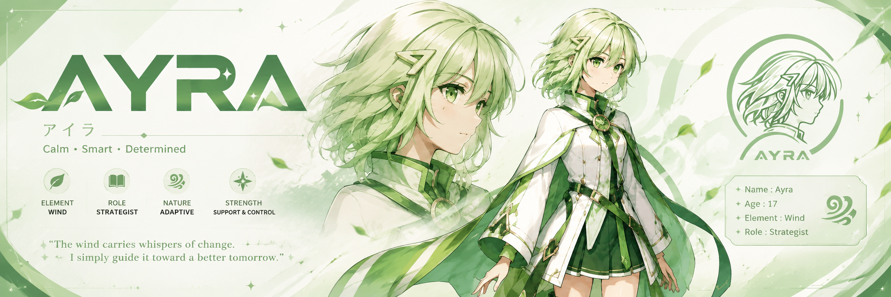

<p align="center">
  
</p>

<p align="center">
  
  
  
  
</p>

<p align="center">
  Wallet tracking · on-chain research · X workflows · Telegram · skill marketplace · private database per user
</p>

<p align="center">
  <a href="#quick-start">Quick start</a> ·
  <a href="#private-database-byod">Private database</a> ·
  <a href="#security">Security</a> ·
  <a href="#license">License</a>
</p>

---

AYRA Agent is a self-hostable platform for building and running **tool-using AI agents** focused on **Solana**, **meme/token research**, and **X (Twitter)** operations. Users bring their own LLM keys and **private Postgres** for chat history and brain tasks.

> **Brand palette:** forest green `#2D5A27` · leaf `#5A8F4E` · mint `#A8D08D` · cream `#F5F9F2`


## Highlights

| Area | What you get |
|------|----------------|
| **Agents** | Office templates (Aria, Sienna, Marcus, Nova, Ayra), custom prompts, skill toggles |
| **Solana** | Wallet watch, token research, RPC monitor, AYRA scan |
| **Social** | X drafts, threads, optional auto-post (double opt-in) |
| **Chat** | Full dashboard chat with sessions, pins, slash commands, image uploads |
| **Brain** | Scheduled tweets, reminders, content calendars — AYRA Brain worker |
| **Privacy** | Required private Postgres (BYOD) for chat + brain |
| **Ops** | Run logs, token usage, Telegram notifications, cron worker |

## Architecture

```
┌─────────────────────────────────────────────────────────────┐
│  Platform Postgres (DATABASE_URL in .env)                   │
│  Users · Agents · Auth · Runs · Settings (encrypted keys)   │
└───────────────────────────┬─────────────────────────────────┘
                            │
         ┌──────────────────┼──────────────────┐
         ▼                  ▼                  ▼
   Dashboard chat      Telegram bot       Agent worker
         │                  │                  │
         ▼                  ▼                  ▼
┌──────────────────────────────────────────────────────────────┐
│ User's private Postgres (required — Settings on first login) │
│ chat_session · chat_message · brain_task                       │
└──────────────────────────────────────────────────────────────┘
```

**Platform operators** sync schema with Prisma (`db push`). **End users** paste a Postgres URL in Settings — tables are created automatically on save.

---

## Quick start

### Prerequisites

- **Node.js 18+**
- **PostgreSQL** (Supabase recommended for platform DB)
- **OpenRouter** or compatible OpenAI API (user or global key)

### 1. Clone and configure

```bash
git clone <your-repo-url> ayra-agent
cd ayra-agent
cp .env.example .env
```

Edit `.env` — minimum required:

| Variable | Purpose |
|----------|---------|
| `DATABASE_URL` | Platform Postgres (pooler URL for Supabase) |
| `DIRECT_DATABASE_URL` | Direct Postgres URL for Prisma |
| `NEXTAUTH_SECRET` | Session signing secret |
| `NEXTAUTH_URL` | App URL (`http://localhost:3000` in dev) |
| `ENCRYPTION_KEY` | 32+ char key for encrypting user secrets at rest |

See [.env.example](./.env.example) for Telegram, X OAuth, Redis, and worker options.

### 2. Install and sync database

```bash
npm install
npx prisma generate
npx prisma db push
npm run prisma:seed
```

> **Note:** If `prisma migrate deploy` fails with **P3005** (database already populated), use `npx prisma db push` for the platform database instead.

### 3. Run

Terminal 1 — web app:

```bash
npm run dev
```

Terminal 2 — worker (scheduler, Telegram polling, brain tasks):

```bash
npm run worker
```

Open [http://localhost:3000](http://localhost:3000), register, create an agent, and open **Dashboard → Chat**.

For production:

```bash
npm run build
npm run start
# plus worker via PM2: pm2 start ecosystem.config.js
```

Run **only one worker** per deployment to avoid duplicate Telegram replies.

---

## Private database (required)

Every user must connect **their own Postgres** for dashboard chat history and AYRA Brain tasks.

### What users do (no CLI)

1. Create an empty Postgres database ([Supabase](https://supabase.com), [Neon](https://neon.tech), Railway, etc.)
2. Copy the **connection string** (URI format)
3. **Dashboard → Settings → Private Database (AYRA)** → paste URL → **Save**

AYRA will:

- Test the connection
- Create tables automatically (`chat_session`, `chat_message`, `brain_task`)
- Migrate existing chat/brain data on first connect
- Encrypt the URL at rest (same as API keys)

Users **never** run `prisma migrate` or `db push` on their database.

### What operators do

Only the **platform** database in `.env` uses Prisma. User private databases use raw SQL `CREATE TABLE IF NOT EXISTS` via the `pg` driver.

Detailed user-facing steps are in the Settings UI and in [docs/private-database.md](./docs/private-database.md).

---

## Security

| Control | Detail |
|---------|--------|
| **Encryption at rest** | User API keys, Telegram token, X credentials, RPC keys, private DB URLs — AES-256-GCM via `ENCRYPTION_KEY` |
| **Auth** | NextAuth credentials; session scoped to user |
| **Isolation** | APIs filter by `userId`; private DB holds only that user's chat/brain rows |
| **Rate limits** | Chat and API routes throttled per user/IP |
| **Agent bounds** | Run timeout, max tool calls, no default shell access |
| **X posting** | Draft-by-default; auto-post requires user + agent opt-in |
| **Logging** | Agent runs and tool usage recorded for audit |

Report vulnerabilities privately — see [SECURITY.md](./SECURITY.md).

---

## Project structure

```
src/
├── app/              # Next.js routes (dashboard, API)
├── lib/
│   ├── agent/        # Runtime, prompts, meme quality
│   ├── brain/        # AYRA Brain store, worker, tasks
│   ├── chat/         # Chat store, commands, private DB routing
│   ├── skills/       # Tool definitions
│   └── telegram/     # Bot handler, polling
├── workers/          # agent-worker.ts (cron + brain)
prisma/               # Platform schema only
storage/              # Generated images, uploads, local brain SQLite fallback
```

---

## Adding skills

1. Create `src/lib/skills/my-skill.ts` implementing `SkillDefinition`
2. Register in `src/lib/skills/index.ts`
3. Run `npm run prisma:seed`

See existing skills in `src/lib/skills/` for patterns (Zod input schema, `ctx.log`, permissions).

---

## Scripts

| Command | Description |
|---------|-------------|
| `npm run dev` | Development server |
| `npm run build` | Production build |
| `npm run start` | Production server |
| `npm run worker` | Scheduler, Telegram, brain worker |
| `npm run db:push` | Sync platform schema (`prisma db push`) |
| `npm run prisma:generate` | Regenerate Prisma client |
| `npm run prisma:seed` | Seed skill catalog |
| `npm run prisma:studio` | Database GUI |
| `npm run lint` | ESLint |

---

## Environment reference

Production checklist:

- [ ] Strong `NEXTAUTH_SECRET` and `ENCRYPTION_KEY`
- [ ] HTTPS and correct `NEXTAUTH_URL`
- [ ] Supabase pooler on `DATABASE_URL`, direct on `DIRECT_DATABASE_URL`
- [ ] `TELEGRAM_POLLING=false` + webhook URL in production
- [ ] Single worker instance
- [ ] X OAuth callback registered at `X_CALLBACK_URL`

Full variable list: [.env.example](./.env.example)

---

## Contributing

See [CONTRIBUTING.md](./CONTRIBUTING.md). Security reports: [SECURITY.md](./SECURITY.md) (private disclosure only).

---

## License

This project is licensed under the **MIT License** — see [LICENSE](./LICENSE).

You may use, modify, and distribute the software with attribution. The software is provided **as is**, without warranty.

---

<p align="center">
  Built for builders who ship on Solana.
</p>
